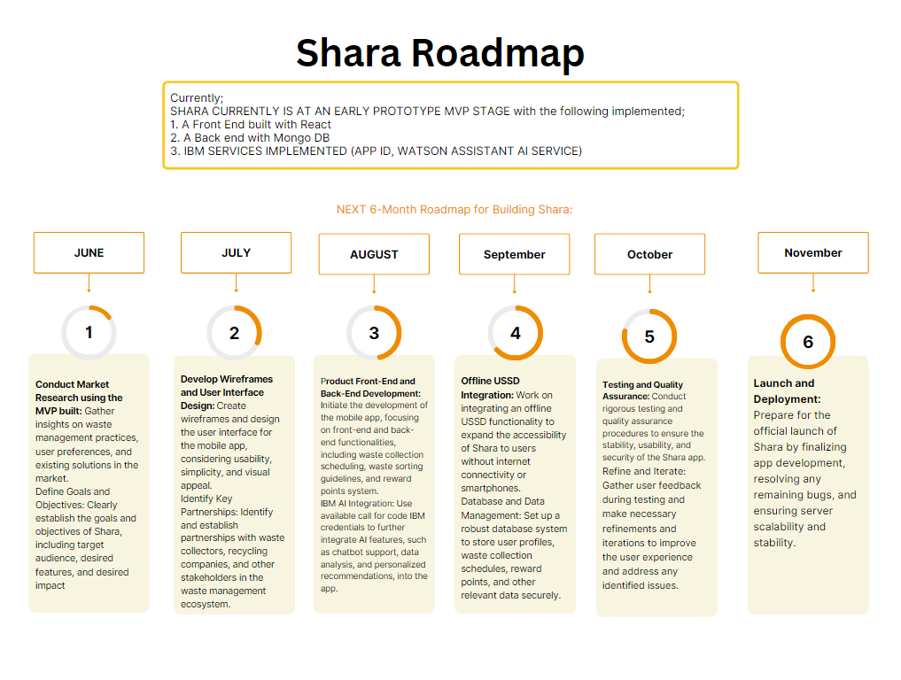

# Shara

## Contents
  - [Short description.](#short-description)
    - [How can technology help?](#how-can-technology-help)
    - [The idea](#the-idea)
  - [Demo video](#demo-video)
  - [The architecture](#the-architecture)
  - [Long description](#long-description)
    - [Shara](#Shara-1)
    - [DID YOU KNOW?](#did-you-know)
    - [The Problem](#the-problem)
    - [SOLUTION](#solution)
  - [Project roadmap](#project-roadmap)
        - [Shara currently does the following:](#Shara-currently-does-the-following)
  - [Live demo](#live-demo)
  - [Built with](#built-with)
    - [Online](#online)

## Short description.
Discover our intuitive waste management app, bringing together homes, waste collectors, and recycling companies effortlessly. Schedule waste collection, earn rewards for responsible sorting, streamline operations for efficient waste management. Connect with recycling companies, contribute to a circular economy. Accessible on smartphones and basic mobile phones through USSD. Solution for a cleaner, greener future!

### How can technology help?

Shara's technology is revolutionizing the waste management industry by providing innovative solutions that address the challenges associated with waste sorting, collection, and recycling. Here's how Shara's technology is making a difference:

Streamlining Waste Collection: Shara's mobile app allows homeowners to easily schedule waste collection from their fingertips. This streamlines the waste collection process, ensuring timely pickups and minimizing missed collections. By optimizing waste collection routes, Shara reduces operational costs and environmental impact.

Promoting Proper Waste Sorting: Shara's app provides comprehensive waste sorting guidelines, educating users on how to correctly sort different types of waste. This promotes responsible waste management practices and increases the quality of recyclable materials, enabling recycling companies to process waste more efficiently.

Encouraging Recycling Participation: Through a rewarding points system, Shara incentivizes users to actively participate in recycling efforts. Users earn points for proper waste sorting and recycling, which can be redeemed for attractive rewards. This motivates individuals and households to adopt sustainable behaviors and contribute to a circular economy.

Enhancing User Experience with AI: Shara integrates IBM Artificial Intelligence into its platform, enhancing the user experience and optimizing waste management processes. AI-powered features include intelligent chatbots for customer support, data analysis for route optimization, and personalized recommendations for waste reduction.

Increasing Accessibility with Offline USSD: Shara's integration of an offline USSD functionality ensures accessibility to users without internet connectivity or smartphones. This widens the reach of the waste management platform, allowing a broader user base to participate in proper waste sorting and benefit from the rewards system.

Connecting Homes to Recycling Companies: Shara establishes partnerships with recycling companies, facilitating the proper disposal and processing of sorted waste. By connecting homes to these recycling companies, Shara ensures that the efforts made by individuals and households in waste sorting have a meaningful impact on the recycling ecosystem.

Educating and Creating Awareness: Shara's platform goes beyond waste management functionalities by providing educational content, tips, and resources on waste reduction and sustainable practices. This empowers users with knowledge and creates awareness about the importance of responsible waste management.

By leveraging technology, Shara is transforming waste management into an efficient, rewarding, and environmentally conscious process. Through their mobile app, integration of AI, offline USSD functionality, and focus on education, Shara is empowering individuals and communities to actively participate in waste reduction and recycling, leading us towards a cleaner and more sustainable future.

### The idea

Shara is an innovative waste management solution that aims to revolutionize the way waste is sorted, collected, and recycled. By leveraging technology, Shara connects homes, waste collectors, and recycling companies through a user-friendly mobile app.

The idea behind Shara is to encourage proper waste sorting and recycling by providing convenience, education, and incentives. Homeowners can easily schedule waste collection, access comprehensive sorting guidelines, and earn reward points for their recycling efforts. The app also features a recycling center locator to facilitate proper waste disposal.

With the integration of IBM Artificial Intelligence, Shara enhances the user experience and optimizes waste management processes. AI-powered chatbots provide customer support, data analysis ensures efficient route optimization, and personalized recommendations promote waste reduction.

Shara goes beyond just waste management by providing educational resources and raising awareness about sustainable practices. By fostering a community-driven approach, Shara empowers individuals to make a positive impact on the environment and contribute to a circular economy.

The offline USSD integration further extends the accessibility of the platform, ensuring that users without internet connectivity or smartphones can participate in proper waste sorting and enjoy the benefits of the rewards system.

Through its technology-driven approach, Shara envisions a future where waste management is efficient, rewarding, and environmentally conscious. By connecting homes, waste collectors, and recycling companies, Shara is transforming waste management into a collaborative effort, creating a cleaner and more sustainable world for future generations.

## Demo video

[Watch the video](https://www.youtube.com/watch?v=hI54VopbpZI)

## The architecture
 - 

## Long description
### Shara

### DID YOU KNOW?

Introducing our innovative waste management app that brings together homes, waste collectors, and recycling companies in a seamless and user-friendly platform. With our app, you can enjoy the following features:

Effortless Waste Collection: Say goodbye to the hassle of scheduling waste collection. Our app allows you to easily book waste pickups at your convenience, ensuring that waste collectors promptly retrieve your waste right from your doorstep.

Rewards for Responsible Sorting: We believe in incentivizing responsible waste sorting. Our app provides comprehensive guidelines on how to correctly sort various types of waste. By following these guidelines, you earn valuable reward points that can be redeemed for exciting perks, making waste management a fulfilling and engaging experience.

Streamlined Operations for Waste Collectors: Our app facilitates efficient operations for waste collectors. They receive real-time notifications for collection requests, optimized routes, and timely reminders, enabling them to provide timely and effective waste collection services.

Empowering Recycling Companies: We understand the importance of promoting a circular economy. Our platform connects recycling companies to sorted waste streams, allowing them to streamline their operations and contribute to a sustainable future.

Accessibility for All: We believe in inclusivity. Our app goes beyond smartphones by integrating an offline USSD functionality. This feature enables users with basic mobile phones to access our services, ensuring that waste management efforts are accessible to everyone.

[Shara website](https://shara-delta.vercel.app/)

### The Problem

The improper sorting of waste from homes has a significant impact on the environment, communities, and the overall waste management system. Here's a statement highlighting the consequences of improper waste sorting:

"The improper sorting of waste from homes has far-reaching consequences for our environment and communities. When waste is not sorted correctly, it often ends up in landfills, where it contributes to the release of harmful greenhouse gases, soil and water pollution, and the depletion of natural resources. This not only poses a threat to the ecosystem but also affects the quality of life for nearby communities, leading to health hazards and reduced air and water quality.

Improper waste sorting also strains the waste management system, increasing operational costs and inefficiencies. Waste collectors face challenges in segregating mixed waste, which hampers recycling efforts and prolongs the time and resources required for waste processing. Ultimately, this leads to missed opportunities for resource recovery, increased landfill usage, and a negative impact on sustainability goals.

Additionally, improper waste sorting limits the potential for creating a circular economy, where materials can be recycled, reused, or repurposed. Valuable resources that could be reclaimed and turned into new products are lost, perpetuating a linear "take-make-dispose" model that is detrimental to our planet's finite resources.

Addressing the issue of improper waste sorting is crucial to mitigate environmental pollution, conserve resources, and foster sustainable communities. Shara's waste management platform empowers individuals and households to properly sort their waste, promoting recycling and reducing the negative impacts associated with improper waste disposal. Together, we can make a positive difference by adopting responsible waste management practices and creating a cleaner, greener future for all."

### SOLUTION

Additionally, Shara focuses on enhancing proper waste sorting practices from homes all the way to recycling companies and dumpsites. We understand that the journey of waste management does not end with waste collection from households. It is equally important to ensure that the sorted waste reaches the appropriate recycling facilities or dumpsites for proper processing and disposal.

Shara's platform facilitates the seamless flow of waste from homes to waste collectors and ultimately to the designated recycling companies or dumpsites. By streamlining this process, we eliminate bottlenecks and ensure that the sorted waste reaches its intended destination efficiently.

Through the Shara app, waste collectors can receive real-time notifications about scheduled pickups, ensuring timely collection and minimizing the chances of missed or delayed collections. This enhances the overall efficiency of the waste management process, reducing the environmental impact and promoting sustainability.

Furthermore, Shara establishes partnerships with recycling companies and dumpsites to ensure that the waste collected is directed to the appropriate facilities for recycling or safe disposal. By actively connecting homes to these crucial waste management stakeholders, we ensure that the waste sorting efforts of individuals and households have a meaningful and impactful outcome.

By enhancing waste sorting practices from homes down to recycling companies and dumpsites, Shara contributes to the larger goal of achieving a circular economy, where waste is effectively managed, resources are conserved, and environmental sustainability is prioritized. 

## Project roadmap

##### Shara currently does the following:
- online and offline learning resources
-Waste Collection Scheduling: Users can schedule waste collection from their homes conveniently through the mobile app, ensuring timely pickups and efficient waste managemen
- Waste Sorting Guidelines: Shara provides comprehensive guidelines on how to correctly sort different types of waste, empowering users to adopt proper waste management practices.
- Reward Points System: Shara implements a rewarding points system to incentivize users for proper waste sorting and recycling. Users earn points that can be redeemed for attractive rewards or discounts.
- Recycling Center Locator: The app includes a feature to locate nearby recycling centers or drop-off points, making it easy for users to dispose of their waste properly and contribute to recycling efforts.
- IBM Artificial Intelligence Integration: Shara integrates IBM AI capabilities to enhance the user experience and optimize waste management processes. AI-powered chatbots provide customer support, data analysis aids in route optimization, and personalized recommendations promote waste reduction. 
- Offline USSD Functionality: Shara incorporates an offline USSD functionality to ensure accessibility for users without internet connectivity or smartphones. This widens the reach of the platform and promotes inclusivity.
- Educational Content: Shara provides educational resources, articles, and tips on waste management and sustainable practices, fostering awareness and promoting responsible waste disposal.
- User Profile Management: Users can manage their profiles, update contact information, and set preferences for notifications and communication.
- Reporting and Feedback: Shara enables users to report issues or provide feedback on waste collection services, ensuring continuous improvement and addressing any concerns.
- Progress and Impact Tracking: The platform allows users to track their waste management progress, including the amount of waste recycled and the environmental impact of their actions.

## Live demo

You can find a running system to test at [Shara.vercel.app](https://shara-delta.vercel.app/).
OFFLINE DEMO LINK [Shara-offline](https://github.com/farex4sure/Shara_ussd) simulator sandbox-(https://simulator.africastalking.com/simulator/ussd) USSD CODE-*384*7115#

## Built with
### Online

- [App-ID] - it is implemented to protect user account, providing authorization and authentication
- [watson assistant AI]- Integrated into the app to interact with the users without the intervention of a live agent. 
- [Google map api](https://cloud.mongodb.com) - To display realtime location of our agents/waste collectors
- [weatherapi] - Live weather update
- [React JS](https://reactjs.org) - JavaScript Library for building component base user interface
- [Tailwind css](https://tailwindcss.com/docs/installation) - Used for styling the user interface
- [Mongo DB](https://cloud.mongodb.com) - Database management system users
- [Render](https://shara-api-vzrf.onrender.com) - Host the backend api
- [Vercel](https://shara-delta.vercel.app) - Host frontend app

### Offline
- [MySQL]() - Database management system USSD
- [PHP] - Programming language used

### Github repositories
 FrontEnd [Shara-online](https://github.com/farex4sure/shara.git)
 Backend [Shara-online](https://github.com/farex4sure/shara-api.git)
